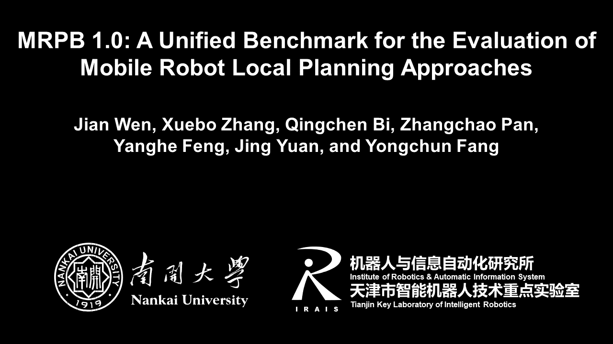

# MRPB: Mobile Robot Local Planning Benchmark

**MRPB** is developed aiming to evaluate mobile robot local planning approaches in a unified and comprehensive way.
It contains a rich set of elaborately designed simulation scenarios, for instance, complex maze environments,
partially unknown office-like environments, dynamic pedestrians, and so on.
More features and challenging scenarios will come in the future :wink:.

The following video shows navigation simulation in static, partially unknown, and dynamic scenarios.

<a href="https://youtu.be/X-N0Sf0-ODY" target="_blank"></a>

To run this project in minutes, check [Quick Start](#1-Quick-Start). Please refer to README.md in each folder to learn more about the contents.

Please cite the following paper if you use this project in your research:
> J. Wen, X. Zhang, Q. Bi, Z. Pan, Y. Feng, J. Yuan, and Y. Fang, "MRPB 1.0: A unified benchmark for the evaluation of mobile robot local planning approaches", ***2021 IEEE International Conference on Robotics and Automation (ICRA)***, 2021, pp. 8238-8244. [[paper]](https://ieeexplore.ieee.org/document/9561901)

## Table of Contents

* [Quick Start](#1-Quick-Start)
* [Setup](#2-Setup)

## 1. Quick Start

The project has been tested on Ubuntu 16.04 (ROS Kinetic) and 18.04 (ROS Melodic). We highly recommend using Ubuntu 18.04 since Ubuntu 16.04 will no longer be supported after April 2021. In the following we will take ROS Melodic version as the example. The navigation simulation is performed by the powerful ROS navigation stack, wherein two local planners of DWA and TEB are tested. Therefore, please install these packages first:

```
$ sudo apt install ros-melodic-navigation ros-melodic-teb-local-planner
```
The distance to the closest obstacle is computed by performing bicubic interpolation on top of the Euclidean distance grid (EDG). EDG is constructed by an efficient distance transform algorithm implemented in OpenCV, and bicubic interpolation is implemented in [Google's Ceres solver](http://ceres-solver.org/). Therefore, please install Ceres solver following the official [installation tutorial](http://ceres-solver.org/installation.html).

After the above preparation, please create and initialize a ROS workspace. We assume that your workspace is named catkin_ ws. Then, run the following commands to clone this repo and build it:

```
$ cd ~/catkin_ws/src
$ git clone https://github.com/NKU-MobFly-Robotics/p3dx.git
$ git clone https://github.com/NKU-MobFly-Robotics/local-planning-benchmark.git
$ cd ../
$ catkin_make
```
If you are using Ubuntu 16.04, please switch to the kinetic-devel branch:
```
$ git branch -a
$ git checkout kinetic-devel
```

Finally, open a new terminal and start a simulation:
```
$ source ~/catkin_ws/devel/setup.bash
$ roslaunch move_base_benchmark move_base_benchmark.launch
```
Open another terminal and send the goal for the robot:
```
$ source ~/catkin_ws/devel/setup.bash
$ roslaunch move_base_benchmark simple_navigation_goals.launch
```
You can also select goals for the robot using the ```2D Nav Goal``` tool in ```RViz```.

## 2. Setup

We use [**Actor Collisions Plugin**](https://github.com/osrf/gazebo/tree/gazebo11/examples/plugins/actor_collisions) to give dynamic pedestrians collision properties, so that they can be swept by the laser rangefinder. From the actor_collisions directory
```
$ mkdir build
$ cd build
$ cmake ../
$ make
```
After that, a library named "libActorCollisionsPlugin.so" will be generated in the build directory. Please update the reference path of "libActorCollisionsPlugin.so" in the xxx_dynamic.world files in the gazebo_world/world directory before you use the dynamic world models. For example, open office02_dynamic.world and use "ctrl+F" to find "libActorCollisionsPlugin.so". Then, replace the value of "filename" with the absolute path of "libActorCollisionsPlugin.so" in your build directory of actor_collisions. Each animated actor needs to call this plugin. Therefore, please check all the reference paths of this plugin in the dynamic world models.

Furthermore, we have tested that dynamic pedestrians based on this plugin can be swept by the laser rangefinder only in Gazebo9 and above. The default version of Gazebo in ROS Kinetic is Gazebo7. Therefore, if you use ROS Kinetic, please uninstall Gazebo7 and install Gazebo9
```
1. Uninstall Gazebo7
  $ sudo apt remove --purge ros-kinetic-gazebo*
  $ sudo apt remove --purge libgazebo*
  $ sudo apt remove --purge gazebo*
  $ sudo apt remove --purge gazebo-*

2. Add the source and keys
  $ sudo sh -c 'echo "deb http://packages.osrfoundation.org/gazebo/ubuntu-stable `lsb_release -cs` main" > /etc/apt/sources.list.d/gazebo-stable.list'
  $ wget http://packages.osrfoundation.org/gazebo.key -O - | sudo apt-key add -

3. Install Gazebo9
  $ sudo apt update
  $ sudo apt install gazebo9
  $ sudo apt install libgazebo9-dev
  $ sudo apt install ros-kinetic-gazebo9-*

4. Check the version of Gazebo
  $ gazebo -v
```

## Acknowledgement
  We use [**Actor Collisions Plugin**](https://github.com/osrf/gazebo/tree/gazebo11/examples/plugins/actor_collisions) to give dynamic pedestrians collision properties and [**Pioneer-3dx Simulator**](https://github.com/BruceChanJianLe/p3dx) to simulate Pioneer 3-DX mobile robot in Gazebo.

## License
The source code is released under [CC0-1.0](https://choosealicense.com/licenses/cc0-1.0/) license.
